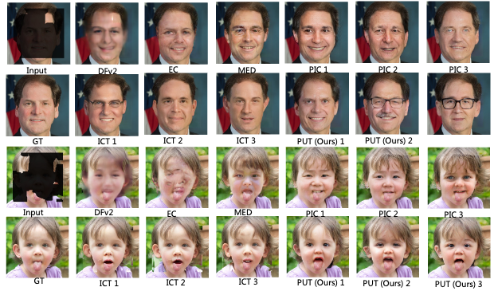

# Clone from [this repo](https://github.com/liuqk3/PUT)
# Reduce Information Loss in Transformers for Pluralistic Image Inpainting

## Overview


##  Some results

- Results on FFHQ


<!--  -->

- Results on Places2


<!--  -->

- Results on ImageNet


<!--  -->

## Introduction

This repo. is the official implementation of our CVPR 2022 paper [Reduce Information Loss in Transformers for Pluralistic Image Inpainting](https://arxiv.org/abs/2205.05076). It is also a codebase for several tasks, especially friend to image synthesis tasks. 

In our interal works, we have re-implented several works with the help of this repo., including [ICT](https://github.com/raywzy/ICT), [DALL-E](https://arxiv.org/abs/2102.12092), [Taming-transformers](https://github.com/CompVis/taming-transformers), [Edge-Connect](https://github.com/knazeri/edge-connect), and so on. 

Enjoy the code and find its convience to produce more awesome works!


## Data preparation
Please ref. [prepare_data](readme/prepare_data.md) for details.

## Installation
Ref. [install_instruction.sh](readme/install_instruction.sh).


## Training

The training command is very simple like this:

```
python train_net --name exp_name --config_file path/to/config.yaml --num_node 1 --tensorboard --auto_resume
```

For example:

```
python train_net --name pvqvae_ffhq --config_file configs/put_cvpr2022/ffhq/patch_vqgan_FFHQ_LinearEnc2PatchDec2_ResBlock8_n512n512d256_euclidean_ema_noPos_ECLossDisc5000_ZeroMask0.3_EraseIm0.2_pconvMask0.7_69.yaml --num_node 1 --tensorboard --auto_resume
```

You can also modify the configures in the given yaml file:

```
python train_net --name pvqvae_ffhq --config_file configs/put_cvpr2022/ffhq/patch_vqgan_FFHQ_LinearEnc2PatchDec2_ResBlock8_n512n512d256_euclidean_ema_noPos_ECLossDisc5000_ZeroMask0.3_EraseIm0.2_pconvMask0.7_69.yaml --num_node 1 --tensorboard --auto_resume dataloader.batch_size 2 solver.base_lr 1.0e-4 dataloader.data_root DATASET
```

NOTE: The training settings are total controlled by the given yaml config file. So making a good yaml config file is quite important!

The trained logs, models, and sampled images are all saved to `./OUTPUT/exp_name`.


## Inference
We provide several inference functions in `./scripts/inference.py`. First of all, you need to train a model or download the pretrained model from [OneDrive](https://mailustceducn-my.sharepoint.com/:f:/g/personal/liuqk3_mail_ustc_edu_cn/EjmcxzE9T_pJunLoVKCxgm4BJt6VRM7cBL2cf3BsSdOarw?e=a3Ynvu), 
or [BaiduYunpan](https://pan.baidu.com/s/1QoxqW66au7wVRqk3POQung) (code: `6po2`) and put them into `./OUTPUT/`.

1) For image reconstruction:

```
python scripts/inference.py --name OUTPUT/pvqvae_exp_name/checkpoint/last.pth --func inference_reconstruction --gpu 0 --batch_size 8
```

2) For image inpainting with provided/trained transformer model to generate single one result for the evalution of some metrics:

```
python scripts/inference.py --name OUTPUT/transformer_exp_name/checkpoint/last.pth --func inference_complet_sample_in_feature_for_evaluation --gpu 0 --batch_size 1
```

Please pay attentnion to some configurations within the function `inference_complet_sample_in_feature_for_evaluation` in [scripts/inference.py](scripts/inference.py).

3) For image inpainting with provided/trained transformer model to generate multiple results for evalution of diversity:

```
python scripts/inference.py --name OUTPUT/transformer_exp_name/checkpoint/last.pth --func inference_complet_sample_in_feature_for_diversity --gpu 0 --batch_size 1
```

Please pay attentnion to some configurations within the function `inference_complet_sample_in_feature_for_diversity` in [scripts/inference.py](scripts/inference.py). Note that this is time consuming. DDP is recommended.


And the resules will be saved to `./RESULTS/exp_name`

## Simpler Inference

For image inpainting with provided/trained transformer model:

```
python scripts/inference_inpainting.py --func inference_inpainting \
--name  OUTPUT/transformer_exp_name/checkpoint/last.pth \
--input_res 256,256 \
--num_token_per_iter 1 \                                                # if given like '1,2,5', the script will loop for each of them
--num_token_for_sampling 50 \                                           # if given like '50,100', the script will loop for each of them
--image_dir path/to/images \
--mask_dir path/to/masks \
--save_masked_image \                                                   # whether to save the masked images 
--save_dir path/to/save \
--num_sample 1 \                                                        # the number of inpainted results for each image-mask pair
--gpu 0                                                                 # GPU ID to use. If not given, DDP is performed   
```

The resules will be saved to `./RESULTS/transformer_exp_name/path/to/save`

## Evaluation
After some results have be generated, the metrics can be obtained by:

```
sh scripts/metrics/cal_metrics.sh path/to/gt path/to/result
```

The diversity can be evaluted by:

```
python scripts/metrics/cal_lpips.py  --path1 path/to/results_dir  --device cuda:0
```


## Citation

If you find our paper/code are helpful, please consider citing:

```
@article{liu2022reduce,
  title={Reduce Information Loss in Transformers for Pluralistic Image Inpainting},
  author={Liu, Qiankun and Tan, Zhentao and Chen, Dongdong and Chu, Qi and Dai, Xiyang and Chen, Yinpeng and Liu, Mengchen and Yuan, Lu and Yu, Nenghai},
  booktitle={IEEE Conference on Computer Vision and Pattern Recognition (CVPR 2022)},
  year={2022}
}
```
